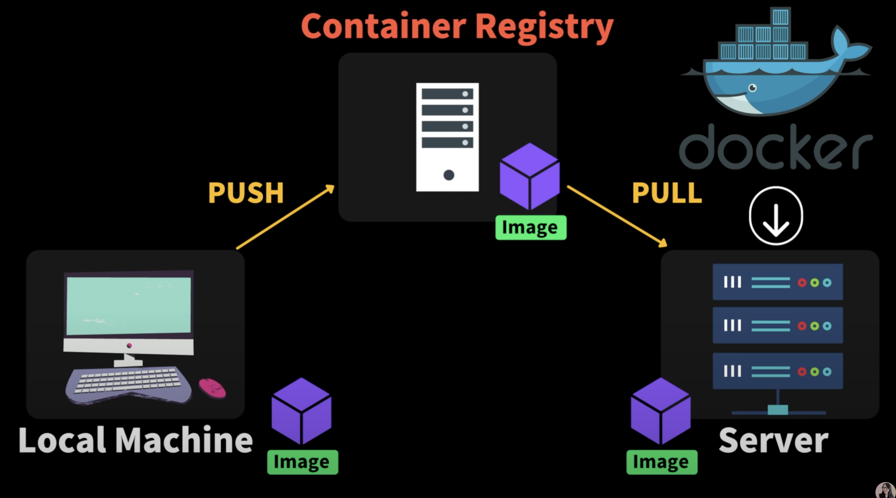
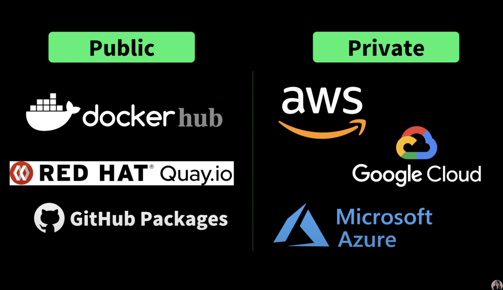
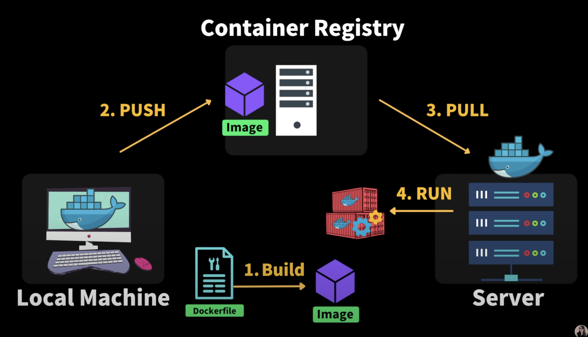

### 도커 이미지 배포 과정

Github를 사용해 봤다면 정말 익숙한 과정이다.

1. 내 로컬 머신에서 이미지를 만든다.

2. Github와 같은 Container Registry라는 곳에 내가 만든 이미지를 푸쉬한다.

3. 필요한 서버나 다른 개발자 pc에서 내가 만들어 놓은 이미지를 가져온 후 실행한다.

### Docker container registry

- public 저장소에서는 **docker hub**가 주로 쓰인다.
- private 저장소는 구글 클라우드 주요 3사에서 주로 제공하고 있다.

### 정리

배포 과정

1. 우리가 개발하고 있는 로컬과 서버에 도커를 설치한다.
2. **도커파일**을 작성한다.
3. 작성한 도커파일을 이용해 우리의 어플리케이션을 스냅샷 할 수 있는 **이미지**를 만든다. (Build)
4. 만든 이미지를 Container registry에 푸쉬한다.
5. 서버에서 이미지를 다운로드 한다
6. **컨테이너**를 실행한다 (Run)
