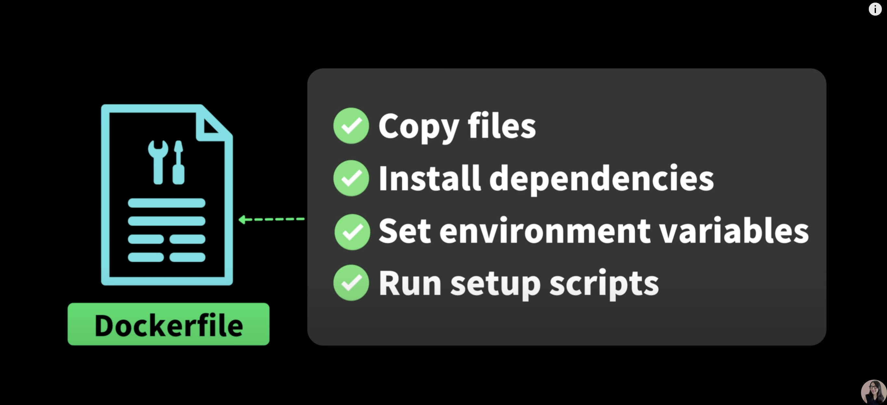

### 컨테이너 만드는 순서

1. Dockerfile
2. Image
3. Container

### Dockerfile 이란?

- 어플리케이션 구동 시 꼭 필요한 파일에는 무엇이 있는지?
- 어떤 프레임워크나 라이브러리를 설치해야하는지?
- 필요한 환경변수를 설정
- 어떻게 구동해야하는지 스크립트 작성

### Image 란?

- 위에서 만든 도커파일을 이용해 이미지를 만들 수 있다.
- 이미지 안에는 어플리케이션 구동에 필요한 모든 것이 포함되있다.
- 만들어진 이미지는 불변의 상태이다.

### Container 란?

- 어플리케이션 구동에 필요한 것을 모두 담고 있는 이미지를 고립된 환경에서 실행.
- 컨테이너 안에서 우리의 어플리케이션이 동작한다.

### Image를 class로 비유하자면

- 동작중인 어플리케이션을 스냅샷을 찍어 이미지로 만든다.
- 만들어진 이미지를 이용해 여러 컨테이너에서 동작시킬 수 있다.
- 각 컨테이너에서 발생하는 변경사항은 이미지에 아무 영향을 주지 않는다.
- image는 클래스 각각의 컨테이너는 만들어진 인스턴스라고 볼 수 있다.
