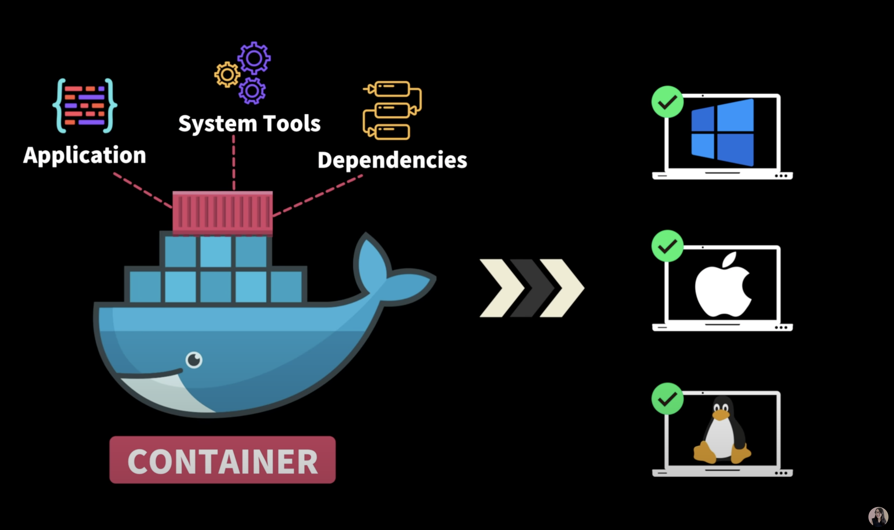

# 1. What is docker ?

도커는 어플리케이션을 패키징 하는 툴이다

소스코드만 업로드해서는 우리의 어플리케이션을 구동 시킬 수 없다.

아래와 적어 놓은 것들을 설치 및 설정 해주는 과정이 필요하다.

- library
- dependencies
- configs

하지만 서버마다 개발자마다 위의 것들을 전부 설치하고 설정하는 것은 매우 번거롭고 에러가 날 확률도 증가한다.

로컬과 서버에 node가 다운로드 되어있다고 해도 버전이 달라 문제가 생기는 경우도 있다.

도커는 위와 같은 문제들을 해결해준다.
도커는 어플리케이션 구동에 필요한 모든 파일과 설정들을 담고 있다.

따라서 도커를 사용하면 어플리케이션 구동에 필요한 파일들을 설치하거나 설정 하는 작업이 필요하지 않기 때문에 매우 편하다.

이쯤되면 docker가 virtual machine과 상당히 비슷하다고 생각 할 수 있는데, 둘의 가장 큰 차이점은 `guest OS를 포함하는가?`이다.

guest OS는 리소스를 꽤 잡아먹기 때문에 무겁다.
그에 반해 container engine(docker Engine)은 굉장히 가볍기 때문에 성능적으로 차이가 난다.
